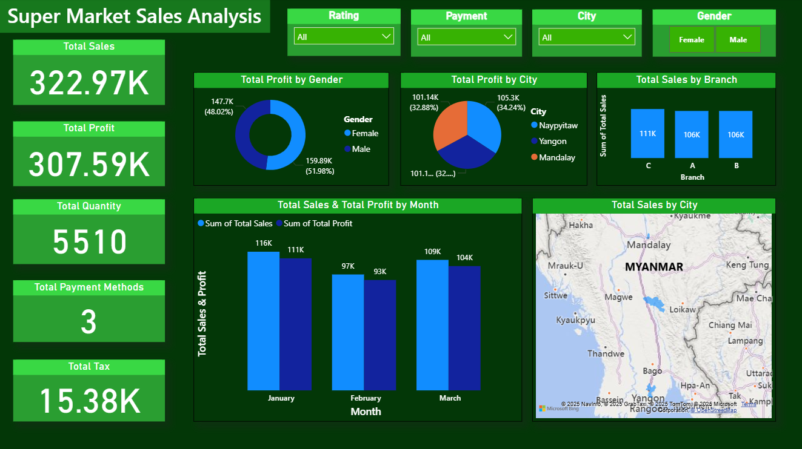

# 🛒 Super Market Sales Analysis – Power BI Dashboard

## 📌 Project Overview
This project is a **Power BI dashboard** created to analyze supermarket sales data.  
It provides insights into sales, profit, quantity, payment methods, and other performance metrics, helping stakeholders make data-driven decisions.

The dashboard uses the dataset **SuperMarket_Sales.csv** and visually represents key business metrics using interactive charts and filters.

---

## 📊 Dashboard Highlights

### Key Features:
- **Total Sales, Profit, Quantity, Tax, and Payment Methods** overview.
- **Profit Analysis by Gender** (Male vs. Female).
- **Profit Analysis by City** (Naypyitaw, Yangon, Mandalay).
- **Sales by Branch** (A, B, C).
- **Monthly Sales & Profit Trends** (January, February, March).
- **Geographical Sales Map** showing city-wise distribution.
- Interactive filters for:
  - **Rating**
  - **Payment Method**
  - **City**
  - **Gender**

---

## 📂 Dataset
**File Name:** `SuperMarket_Sales.csv`

The dataset contains supermarket sales transaction details with the following columns:
- `Invoice ID` – Unique ID for each transaction
- `Branch` – Branch code (A, B, C)
- `City` – City name
- `Customer type` – Type of customer (e.g., Member, Normal)
- `Gender` – Customer gender
- `Product line` – Category of products sold
- `Unit price` – Price of each item
- `Quantity` – Number of items purchased
- `Tax 5%` – Tax amount
- `Total` – Total sales amount
- `Date` – Date of transaction
- `Time` – Time of transaction
- `Payment` – Payment method (Cash, Credit Card, Ewallet)
- `COGS` – Cost of goods sold
- `Gross margin percentage` – Gross margin %
- `Gross income` – Profit amount
- `Rating` – Customer satisfaction rating

---

## 🛠 Tools & Technologies
- **Microsoft Power BI** – Data visualization & dashboard creation
- **CSV Dataset** – Source data for analysis
- **DAX** – Calculations and measures in Power BI

---

## 🚀 How to Use
1. Download the repository.
2. Open `SuperMarketSalesDashboard.pbix` (if provided) in **Power BI Desktop**.
3. Connect to the dataset (`SuperMarket_Sales.csv`) if required.
4. Interact with the filters to explore different aspects of the sales data.

---

## 📈 Insights Gained
- **Highest Sales Month:** January
- **Top Branch by Sales:** Branch C
- **Gender Impact:** Female customers contributed slightly more profit than male customers.
- **City Comparison:** Yangon and Mandalay lead in profit generation.
- **Payment Methods:** Multiple payment options are used, with a nearly even distribution.

---

## 📜 License
This project is for educational and analytical purposes only. Dataset sourced for demonstration.

---

